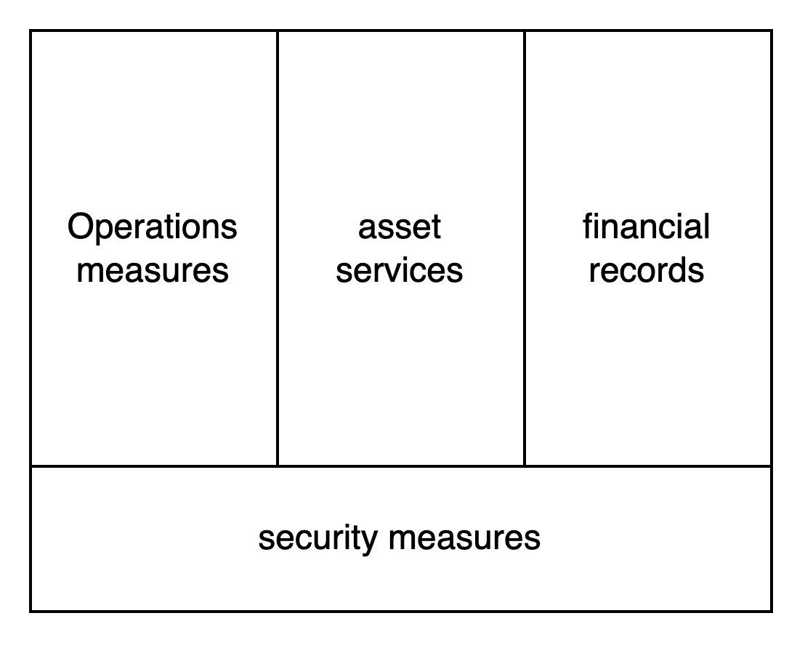

# Welcome

## Thank you for choosing Cregis 

Thank you for choosing and trusting Cregis. As a professional encrypted asset service platform, Cregis is committed to providing you with a secure and user-friendly one-stop encrypted asset financial solution based on financial-grade security infrastructure, as follows:

<figure><figcaption></figcaption></figure>

1. Reliable Security Facilities: Multi-party collaborative signature process built on MPC and TEE secure technologies.
2. Flexible Operation and Maintenance Measures: Enterprise-level approval for payments, organization/member/permission configurations.
3. Rich Asset Services: End-to-end encrypted asset financial management processes tailored for enterprises, including services such as withdrawals/payments, deposits, and receipts mentioned in this document.
4. Automated Financial Accounting: Automatically records asset inflows and outflows.

## When to Use Cregis APIs 

Customers can choose between the Cregis terminal application or Cregis APIs to access Cregis services. The terminal application offers a user-friendly graphical interface suitable for operational management and low-frequency financial service applications. Cregis APIs, on the other hand, serve as the backend entry point for high-frequency financial services tailored for enterprises.

<figure><figcaption></figcaption></figure>

## Cregis APIs Features and Use Cases 

Cregis APIs offer a wide range of services including user deposits for various encrypted digital assets, order receipts, enterprise withdrawals (payments), and associated inquiries and notifications.

<figure><figcaption></figcaption></figure>

Clients can flexibly integrate and combine corresponding services according to their own business models. Below are examples focusing on exchanges and e-commerce.

#### Exchanges 

Exchanges require addressing the high volume of individual customer daily deposit and withdrawal demands with stable and efficient service interfaces. Cregis APIs provide deposit and withdrawal interfaces to meet these requirements, establishing bidirectional fund channels between exchanges and customers, as depicted in the diagram below:

<figure><figcaption></figcaption></figure>

#### E-commerce 

In the day-to-day operations of e-commerce, handling numerous sales order receipts for customers and managing purchase payments to different suppliers is crucial. Cregis APIs offer interfaces for order receipts and payments, meeting these demands and establishing fund channels between the e-commerce platform and its upstream and downstream partners, as shown in the diagram below:

<figure><figcaption></figcaption></figure>

## Cregis APIs Service Integration 

The suggestion is to divide the service integration work of Cregis APIs into three distinct stages, including the technical verification stage, the product environment integration stage, and the operational stage.

<figure><figcaption></figcaption></figure>

1. Technical Validation Phase: During this phase, customers can swiftly grasp the primary functionalities of the API. Based on their business requirements, they can gain an in-depth understanding of the specific descriptions of API processes of interest and utilize the API debugging tool for rapid testing and validation.
2. Product Environment Integration Phase: Following technical validation, customers will have ample confidence to commence product integration for deploying actual product services. In this phase, customers need to first activate formal services and set up the formal product environment using the Cregis terminal application, configuring the corresponding interface environment parameters.
3. Operational Phase: Once the service enters the operational phase, if adjustments to the service are necessary, the aforementioned process can be repeated.

> Note: This document primarily focuses on the first phase, enabling developers to conduct technical integration and validation using this document and the API debugging tool without requiring business activation.

## SDK Support 

The project interfaces offer SDKs for developers in popular programming languages. Please visit the following link to download and install the latest version of the SDK:\
Java\
[https://github.com/0xcregis/cregis-java-sdk](https://github.com/0xcregis/cregis-java-sdk)\
Go\
[https://github.com/0xcregis/cregis-go-sdk](https://github.com/0xcregis/cregis-go-sdk)\
Php\
[https://github.com/0xcregis/cregis-sdk-php](https://github.com/0xcregis/cregis-sdk-php)\
C#\
[https://github.com/0xcregis/cregis-sdk-csharp](https://github.com/0xcregis/cregis-sdk-csharp)
